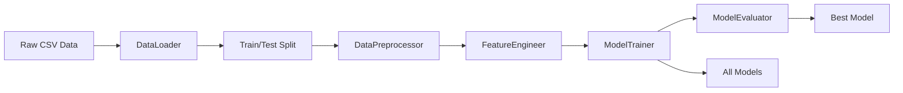

# Developer Guide

## Table of Contents

- [Getting Started](#getting-started)
- [Project Architecture](#project-architecture)
- [Development Workflow](#development-workflow)
- [Code Standards](#code-standards)
- [Testing](#testing)
- [Pipeline Components](#pipeline-components)
- [Adding New Features](#adding-new-features)
- [Debugging](#debugging)
- [Performance Optimization](#performance-optimization)

---

## Getting Started

### Prerequisites

- **Python:** 3.9 or higher
- **pip:** Latest version
- **Git:** For version control
- **Virtual Environment:** Recommended (venv or conda)

### Initial Setup

1. **Clone the repository**
   ```bash
   git clone <repository-url>
   cd Hotel
   ```

2. **Create virtual environment**
   ```bash
   # Using venv
   python -m venv venv
   
   # Activate on Windows
   venv\Scripts\activate
   
   # Activate on Linux/Mac
   source venv/bin/activate
   ```

3. **Install dependencies**
   ```bash
   pip install -r requirements.txt
   ```

4. **Verify installation**
   ```bash
   python validate_structure.py
   ```

5. **Run the pipeline**
   ```bash
   python main.py
   ```

---

## Project Architecture

### Directory Structure

```
Hotel/
├── src/                           # Source code modules
│   ├── __init__.py               # Package initialization
│   ├── data_loader.py            # Data loading and splitting
│   ├── preprocess.py             # Data preprocessing
│   ├── feature_engineering.py    # Feature creation
│   ├── train.py                  # Model training
│   └── evaluate.py               # Model evaluation
├── data/                         # Data storage
│   ├── raw/                      # Original datasets
│   └── processed/                # Processed datasets
├── models/                       # Saved model files
├── logs/                         # Pipeline logs and reports
├── notebooks/                    # Jupyter notebooks for EDA
├── .github/workflows/            # CI/CD workflows
├── docs/                         # Documentation
├── main.py                       # Pipeline orchestrator
├── requirements.txt              # Python dependencies
└── README.md                     # Project overview
```

### Module Dependencies

```
main.py
   ├── data_loader.py
   ├── preprocess.py
   │      └── data_loader.py
   ├── feature_engineering.py
   │      └── preprocess.py
   ├── train.py
   │      └── feature_engineering.py
   └── evaluate.py
          └── train.py
```

### Data Flow



---

## Development Workflow

### 1. Understanding the Pipeline Stages

#### Stage 1: Data Loading
- **File:** `src/data_loader.py`
- **Purpose:** Load CSV data, validate schema, create train-test splits
- **Key Class:** `DataLoader`

#### Stage 2: Preprocessing
- **File:** `src/preprocess.py`
- **Purpose:** Clean data, handle missing values, encode targets
- **Key Class:** `DataPreprocessor`

#### Stage 3: Feature Engineering
- **File:** `src/feature_engineering.py`
- **Purpose:** Create derived features, handle outliers, encode categoricals, scale features
- **Key Class:** `FeatureEngineer`

#### Stage 4: Model Training
- **File:** `src/train.py`
- **Purpose:** Train multiple models, handle class imbalance with SMOTE, hyperparameter tuning
- **Key Class:** `ModelTrainer`

#### Stage 5: Model Evaluation
- **File:** `src/evaluate.py`
- **Purpose:** Evaluate models, generate reports, visualize results
- **Key Class:** `ModelEvaluator`

### 2. Running Individual Modules

Each module can be run independently for testing:

```bash
# Test data loading
python -m src.data_loader

# Test preprocessing
python -m src.preprocess

# Test feature engineering
python -m src.feature_engineering

# Test model training
python -m src.train
```

---

## Code Standards

### Python Style Guide

Follow **PEP 8** standards with these key points:

1. **Indentation:** 4 spaces (no tabs)
2. **Line Length:** Maximum 100 characters
3. **Naming Conventions:**
   - Classes: `PascalCase` (e.g., `DataLoader`)
   - Functions/Methods: `snake_case` (e.g., `load_data`)
   - Constants: `UPPER_SNAKE_CASE` (e.g., `EXPECTED_COLUMNS`)
   - Private methods: Prefix with `_` (e.g., `_validate_schema`)

### Documentation Standards

#### Docstrings

Use Google-style docstrings:

```python
def my_function(param1, param2):
    """
    Brief description of function.
    
    Args:
        param1 (type): Description of param1
        param2 (type): Description of param2
        
    Returns:
        return_type: Description of return value
        
    Raises:
        ErrorType: Description of when this error occurs
        
    Example:
        >>> result = my_function("value1", "value2")
    """
    pass
```

#### Comments

```python
# Short comments on single line

# For longer explanations, use multiple lines
# with each line starting with a hash and space
# to maintain readability
```

### Logging Standards

Use the built-in `logging` module:

```python
import logging

logger = logging.getLogger(__name__)

# Log levels
logger.debug("Detailed information for debugging")
logger.info("General informational messages")
logger.warning("Warning messages")
logger.error("Error messages")
logger.critical("Critical errors")
```

---

## Testing

### Manual Testing

1. **Test data loading:**
   ```bash
   python -c "from src.data_loader import DataLoader; loader = DataLoader(); data = loader.load_data(); print(f'Loaded {len(data)} records')"
   ```

2. **Test preprocessing:**
   ```bash
   python -c "from src.preprocess import DataPreprocessor; from src.data_loader import DataLoader; loader = DataLoader(); data = loader.load_data(); X_train, X_test, y_train, y_test = loader.create_train_test_split(); preprocessor = DataPreprocessor(); X_prep, y_prep = preprocessor.fit_transform(X_train, y_train); print(f'Preprocessed shape: {X_prep.shape}')"
   ```

3. **Test full pipeline:**
   ```bash
   python main.py --data-path data/raw/Hotel_Reservations.csv
   ```

### Automated Testing

Create test files in a `tests/` directory:

```python
# tests/test_data_loader.py
import pytest
from src.data_loader import DataLoader

def test_load_data():
    loader = DataLoader('data/raw/Hotel_Reservations.csv')
    data = loader.load_data()
    assert data is not None
    assert len(data) > 0

def test_train_test_split():
    loader = DataLoader('data/raw/Hotel_Reservations.csv')
    loader.load_data()
    X_train, X_test, y_train, y_test = loader.create_train_test_split(test_size=0.2)
    assert len(X_train) > len(X_test)
```

Run tests:
```bash
pytest tests/
```

---

## Pipeline Components

### Data Validation

The pipeline validates data at multiple stages:

1. **Schema Validation** (in DataLoader):
   - Checks for all expected columns
   - Validates data types

2. **Data Quality Checks** (in DataPreprocessor):
   - Handles missing values
   - Detects and clips negative values in count columns
   - Fills missing values appropriately

3. **Feature Validation** (in FeatureEngineer):
   - Handles outliers using winsorization
   - Validates feature distributions

### Error Handling

Each module implements error handling:

```python
try:
    # Operation
    data = pd.read_csv(file_path)
except FileNotFoundError:
    logger.error(f"File not found: {file_path}")
    raise
except Exception as e:
    logger.error(f"Unexpected error: {str(e)}")
    raise
```

### Logging Strategy

Logs are created for:
- Pipeline execution (timestamped log files in `logs/`)
- Each stage completion
- Errors and warnings
- Performance metrics

Log files include:
- `pipeline_YYYYMMDD_HHMMSS.log`: Full pipeline execution log
- `evaluation_report.json`: Model evaluation results
- Visualization PNG files

---

## Adding New Features

### Adding a New Engineered Feature

1. **Update `FeatureEngineer._create_features()` method:**

```python
def _create_features(self, df):
    """Create all engineered features."""
    df = df.copy()
    
    # Existing features...
    
    # Add your new feature
    df['your_new_feature'] = df['column1'] / (df['column2'] + 1e-6)
    logger.info("Created feature: your_new_feature")
    
    return df
```

2. **Document the feature** in the README and docstrings

3. **Test the feature:**
   ```python
   python -m src.feature_engineering
   ```

### Adding a New Model

1. **Add training method to `ModelTrainer`:**

```python
def train_gradient_boosting(self, X_train, y_train):
    """
    Train Gradient Boosting model.
    
    Args:
        X_train: Training features
        y_train: Training labels
        
    Returns:
        Trained model
    """
    from sklearn.ensemble import GradientBoostingClassifier
    
    logger.info("Training Gradient Boosting model...")
    
    model = GradientBoostingClassifier(
        n_estimators=200,
        learning_rate=0.1,
        max_depth=5,
        random_state=self.random_state
    )
    
    model.fit(X_train, y_train)
    logger.info("✓ Gradient Boosting training complete")
    
    return model
```

2. **Update `train_all_models()` method:**

```python
def train_all_models(self, X_train, y_train, use_smote=True, tune_xgboost=False):
    # Existing code...
    
    # Train new model
    gb_model = self.train_gradient_boosting(X_train_resampled, y_train_resampled)
    self.models['Gradient Boosting'] = gb_model
    
    return self.models
```

### Adding Custom Preprocessing

Create a new preprocessing step in `DataPreprocessor`:

```python
def _custom_preprocessing(self, df):
    """
    Apply custom preprocessing logic.
    
    Args:
        df (pd.DataFrame): Input data
        
    Returns:
        pd.DataFrame: Processed data
    """
    df = df.copy()
    
    # Your custom logic here
    
    logger.info("Custom preprocessing complete")
    return df
```

Then call it in `fit_transform()` and `transform()` methods.

---

## Debugging

### Common Issues and Solutions

#### Issue 1: Module Import Errors

**Problem:**
```
ModuleNotFoundError: No module named 'src'
```

**Solution:**
```python
# Add at the beginning of scripts
import sys
from pathlib import Path
sys.path.insert(0, str(Path(__file__).parent))
```

#### Issue 2: Data File Not Found

**Problem:**
```
FileNotFoundError: Data file not found
```

**Solution:**
- Verify the data file exists: `ls data/raw/Hotel_Reservations.csv`
- Check the path in the command: `--data-path data/raw/Hotel_Reservations.csv`

#### Issue 3: Memory Issues with SMOTE

**Problem:**
```
MemoryError when applying SMOTE
```

**Solution:**
- Run without SMOTE: `python main.py --use-smote False`
- Reduce dataset size for testing
- Use a machine with more RAM

#### Issue 4: Model Training Too Slow

**Problem:**
XGBoost hyperparameter tuning takes too long

**Solution:**
- Skip tuning: `python main.py` (default is no tuning)
- Reduce search space in `train_xgboost()` method
- Use fewer CV folds

### Debug Mode

Enable detailed logging:

```python
import logging

logging.basicConfig(
    level=logging.DEBUG,  # Changed from INFO
    format='%(asctime)s - %(name)s - %(levelname)s - %(message)s',
    handlers=[
        logging.FileHandler('debug.log'),
        logging.StreamHandler()
    ]
)
```

### Inspecting Intermediate Results

Save intermediate results for debugging:

```python
# After preprocessing
X_train_prep.to_csv('intermediate/X_train_preprocessed.csv', index=False)

# After feature engineering
X_train_eng.to_csv('intermediate/X_train_engineered.csv', index=False)
```

---

## Performance Optimization

### Tips for Faster Execution

1. **Use smaller test size during development:**
   ```bash
   python main.py --test-size 0.3
   ```

2. **Skip hyperparameter tuning:**
   ```bash
   python main.py --tune-xgboost False
   ```

3. **Disable SMOTE for quick tests:**
   ```bash
   python main.py --use-smote False
   ```

4. **Profile your code:**
   ```python
   import cProfile
   import pstats
   
   profiler = cProfile.Profile()
   profiler.enable()
   
   # Your code here
   
   profiler.disable()
   stats = pstats.Stats(profiler).sort_stats('cumtime')
   stats.print_stats(20)
   ```

### Memory Optimization

1. **Delete large variables when done:**
   ```python
   del large_dataframe
   import gc
   gc.collect()
   ```

2. **Use data types efficiently:**
   ```python
   # Convert float64 to float32 if precision allows
   df = df.astype('float32')
   ```

3. **Process data in chunks if necessary:**
   ```python
   for chunk in pd.read_csv('large_file.csv', chunksize=10000):
       process(chunk)
   ```

---

## Best Practices

### 1. Always Use Version Control

- Commit frequently with clear messages
- Create feature branches for new developments
- Use meaningful branch names (e.g., `feature/add-svm-model`)

### 2. Maintain Reproducibility

- Always set random seeds
- Document dependencies in `requirements.txt`
- Save model versions with timestamps

### 3. Document Your Changes

- Update docstrings
- Update README if adding features
- Add comments for complex logic

### 4. Validate Your Changes

- Test on the full pipeline
- Check that CI/CD passes
- Verify outputs match expectations

### 5. Code Review Checklist

Before submitting code:
- [ ] Code follows PEP 8 style guide
- [ ] All functions have docstrings
- [ ] Logging is implemented appropriately
- [ ] Error handling is in place
- [ ] Tests pass (if applicable)
- [ ] Documentation is updated
- [ ] No hardcoded paths or credentials
- [ ] Performance is acceptable

---

## Troubleshooting CI/CD

### GitHub Actions Workflow

The workflow runs automatically on:
- Push to `main` or `develop` branches
- Pull requests to `main`
- Manual trigger

### Common CI/CD Issues

#### Data File Missing in CI

**Solution:** Ensure `data/raw/Hotel_Reservations.csv` is committed to the repository.

#### Dependencies Not Installing

**Solution:** Verify `requirements.txt` is up to date and all versions are compatible.

#### Pipeline Timeout

**Solution:** Modify timeout in `.github/workflows/ml-pipeline.yml`:
```yaml
timeout-minutes: 45  # Increase from 30
```

---

## Contributing

### Submitting Changes

1. Fork the repository
2. Create a feature branch
3. Make your changes
4. Test thoroughly
5. Submit a pull request

### Pull Request Guidelines

Include in your PR:
- Clear description of changes
- Reason for the changes
- Any breaking changes
- Updated documentation
- Test results

---

## Resources

### Python Libraries Documentation

- [pandas](https://pandas.pydata.org/docs/)
- [scikit-learn](https://scikit-learn.org/stable/)
- [XGBoost](https://xgboost.readthedocs.io/)
- [imbalanced-learn](https://imbalanced-learn.org/)

### Machine Learning Resources

- [Scikit-learn User Guide](https://scikit-learn.org/stable/user_guide.html)
- [XGBoost Parameters](https://xgboost.readthedocs.io/en/stable/parameter.html)
- [SMOTE for Imbalanced Learning](https://imbalanced-learn.org/stable/references/generated/imblearn.over_sampling.SMOTE.html)

---

## Contact

For questions or issues:
- Open an issue on GitHub
- Check existing documentation
- Review logs for error messages
